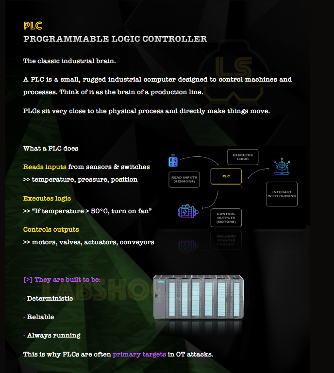

Comenzamos por leer acerca de que es HMI (Human-Machine Interface) y las workstations

A continuacion entramos al dashboard del HMI donde podemos ver un diagrama del sistema corriendo en tiempo real

En el podemos comprobar como el sistema esta corriendo (switch encendido) y los valores de los distintos elementos que componen el sistema (Valvulas, bombas, sensores de presion...)

