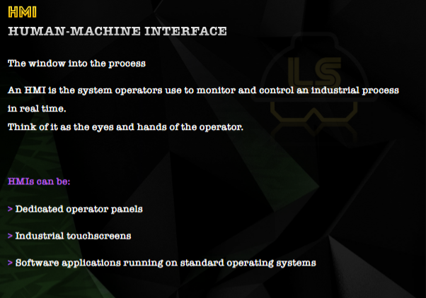
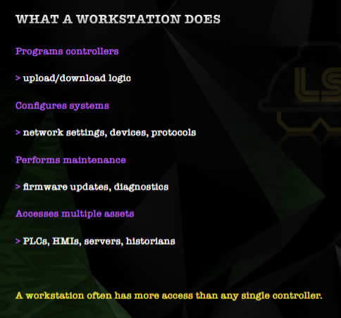
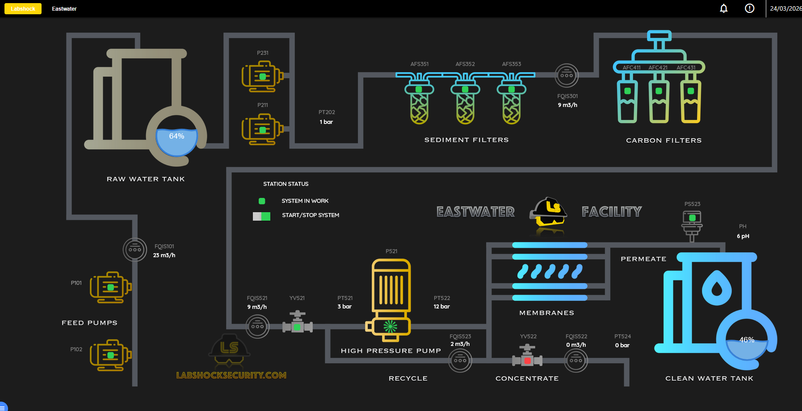
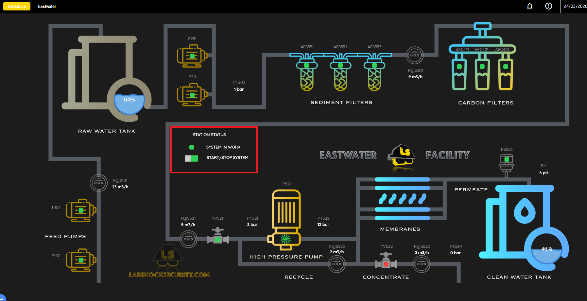
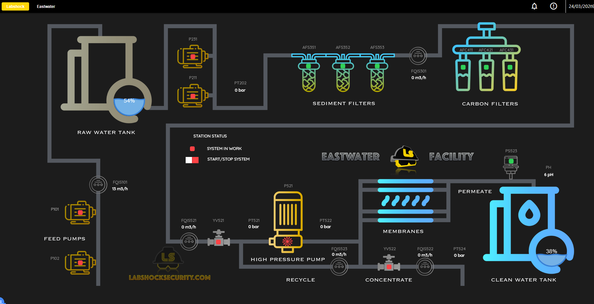
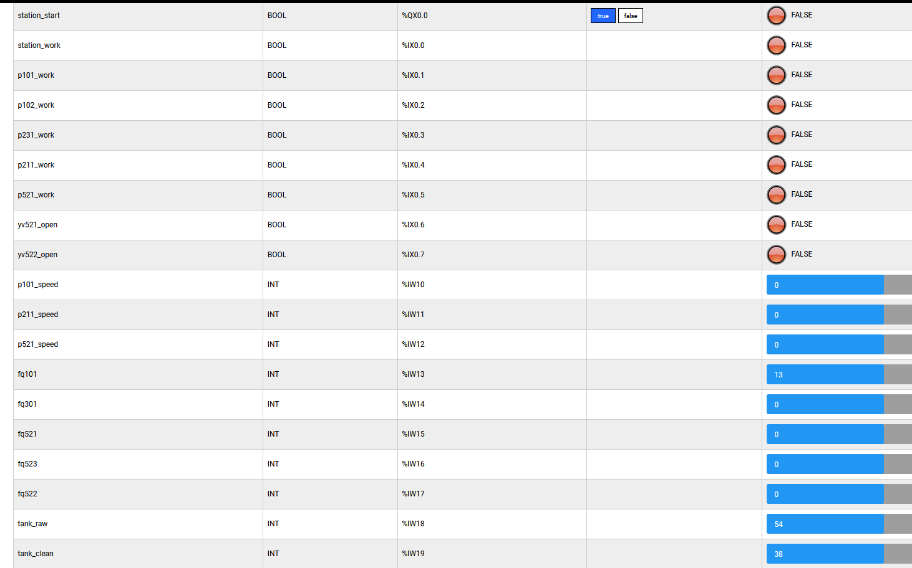
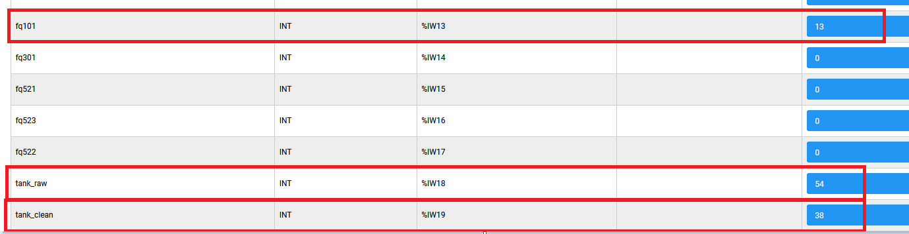
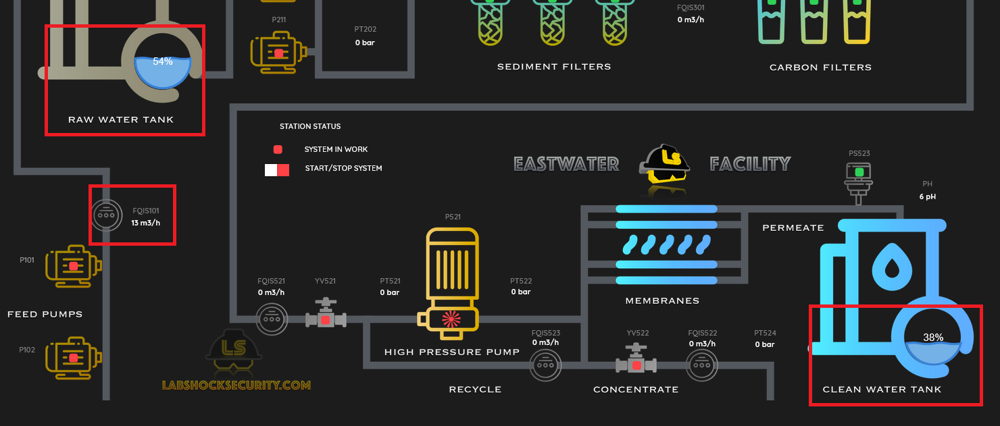

En este laboratorio veremos que es el HMI, su relacion con el PLC y como el HMI traslada las decisiones del operador en ordenes al PLC en una relacion de causa-efecto.

Input del operador -> Comando en HMI -> Logica en PLC -> Resultados en el sistema fisico.

Comenzamos por leer acerca de que es HMI (Human-Machine Interface) y las workstations

A continuacion entramos al dashboard del HMI donde podemos ver un diagrama del sistema corriendo en tiempo real

En el podemos comprobar como el sistema esta corriendo (switch encendido) y los valores de los distintos elementos que componen el sistema (Valvulas, bombas, sensores de presion...)

Probamos de apagar el switch y con ello ver las variaciones en el sistema, como cae la presion, como se detiene el flujo del agua, etc.

Finalmente descubrimos la relacion entre el PLC (Programmable Logic Controller) y el HMI (Human-Machine Interface), abrimos ambos y vemos como interactuar en uno tiene efectos en el otro.

Al haber apagado el switch en el HMI vemos como el cambio se refleja en el PLC (y viceversa, los cambios en el PLC se reflejan en el HMI)

Sin embargo tambien podemos ver que hay cierto retraso en la actualizacion entre PLC y HMI que se debe tener en cuenta
